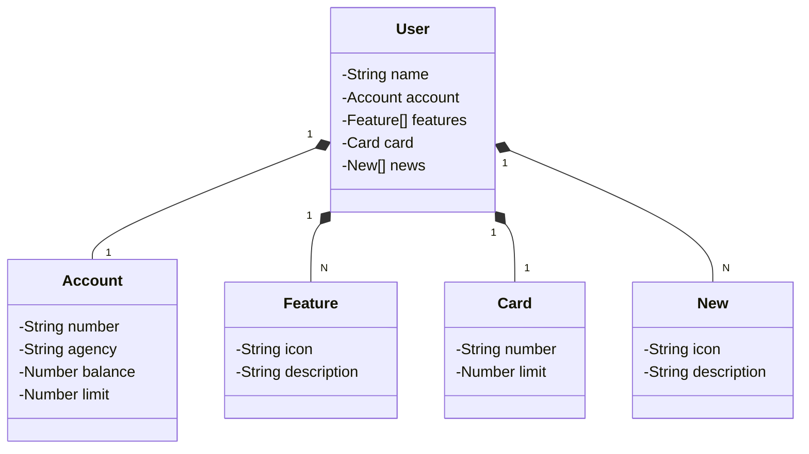

# Santander-Dev-Week

Projeto base desenvolvido durante a Santander Dev Week usando Java e Spring Boot.

## Tecnologias

- Java 25
- Spring Boot
- Gradle

## Como executar

1. No diretório do projeto, execute:
   ```bash
   ./gradlew bootRun
   ```
2. Para usar o perfil de desenvolvimento com H2, defina `SPRING_PROFILES_ACTIVE=dev`.
3. A aplicação iniciará localmente com as configurações de `src/main/resources/application-dev.yml`.

## Estrutura principal

- `src/main/java`: código-fonte da aplicação
- `src/main/resources`: arquivos de configuração e recursos estáticos
- `src/test/java`: testes automatizados

## Avanços deste push

- Modelagem inicial do domínio com `User`, `Account`, `Card`, `Feature` e `New`.
- Criação do repositório `UserRepository` com Spring Data JPA.
- Configuração do perfil `dev` com banco H2 em memória em `application-dev.yml`.
- Adição do launch profile do VS Code para executar a aplicação em modo debug.

## Diagrama de classes



## Objetivo

Este repositório contém os arquivos iniciais do projeto para evolução durante os estudos da Santander Dev Week.
